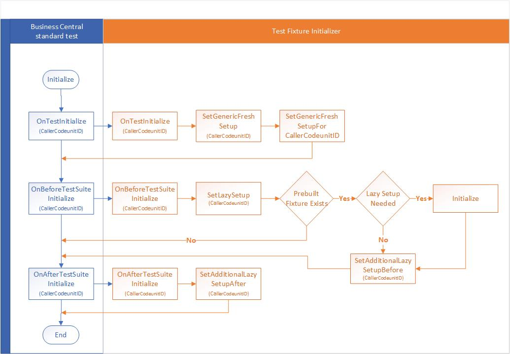

# Test Fixture Initializer
The standard Microsoft Dynamics 365 Business Central test colleteral contains over 22,000 automated test that covr the most part of standard functional areas like G/L, Sales, Purchase, Manufacturing, etc. If your solution has been extending any of this it makes perfect sense to get these standard tests running on your solution. As described in various posts on my blog regarding [testability](http://dynamicsuser.net/tags/testability {:target="_blank"}) it's not that difficult to get that going as inmost cases it's [all about data](https://dynamicsuser.net/nav/b/vanvugt/posts/let-s-talk-about-text-fixture-and-how-to-profit-from-this-with-the-ms-nav-test-toolkit target="_blank").

This repo contains an .al extension suggestion to setup prebuilt, shared and (generic) fresh fixture to get standard MS tests run on your solution. This schema shows how the various parts relate to each other:
 

Feel free to make use the code, and share your suggestions for improvements be means of an issue report.
